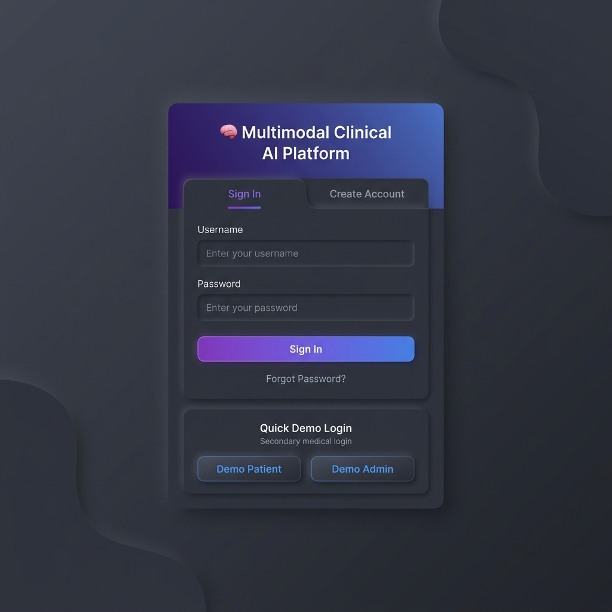
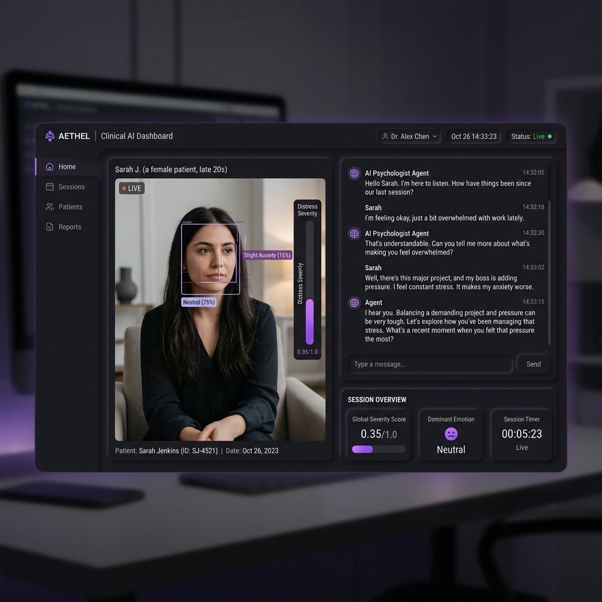
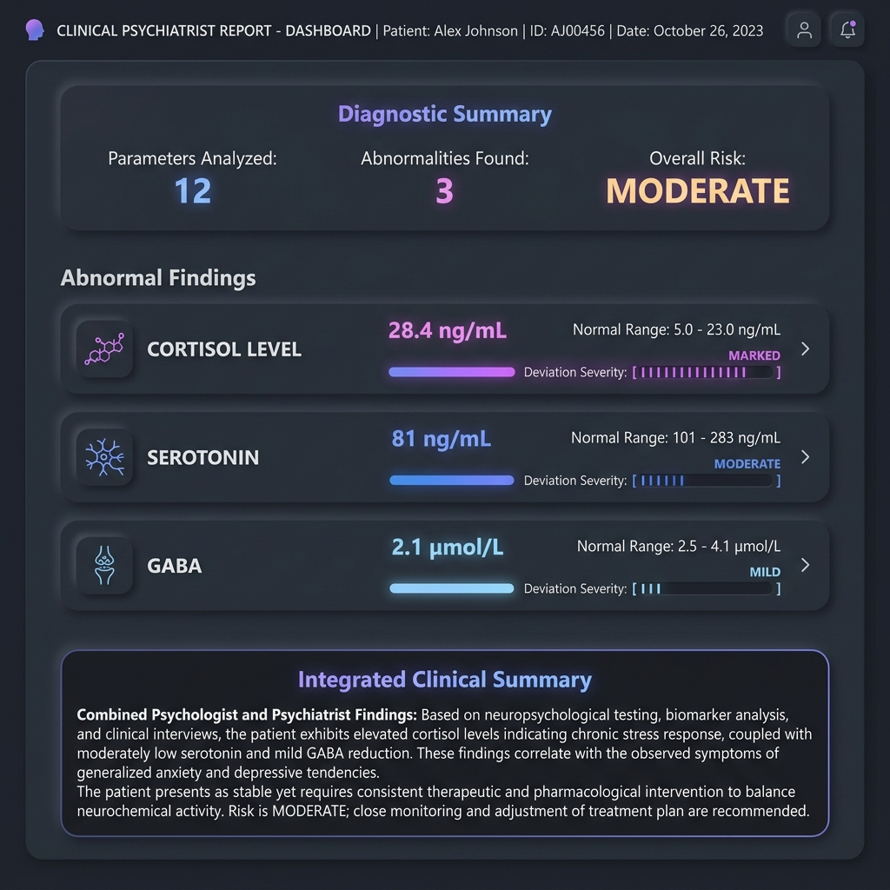
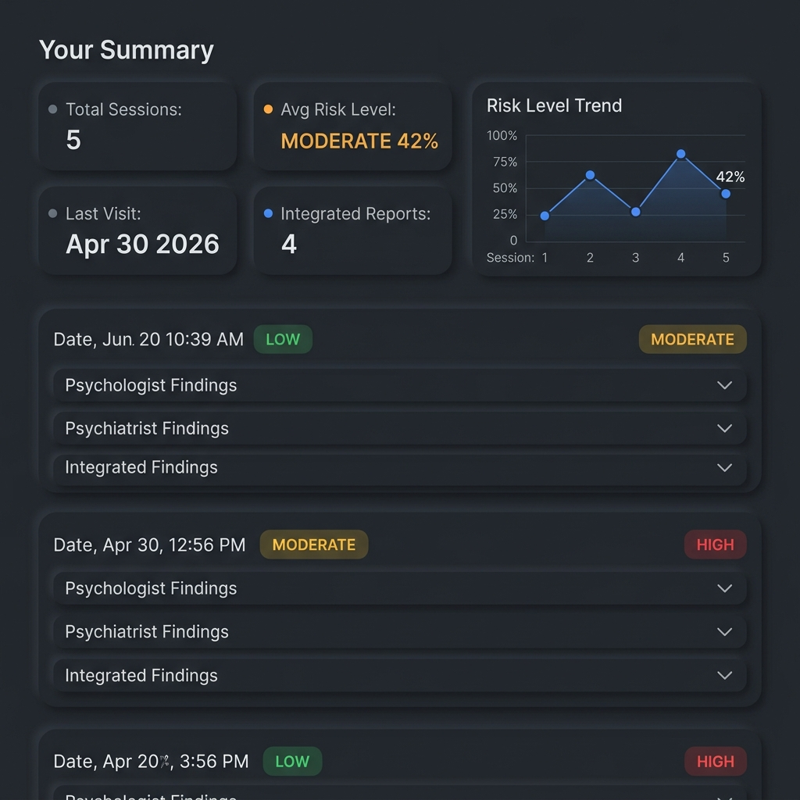
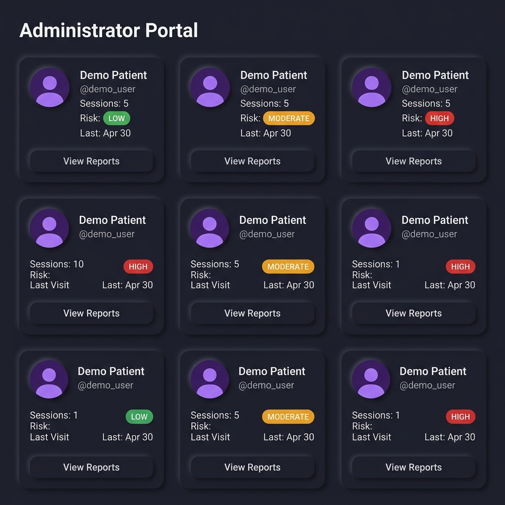

# 🧠 Multimodal Clinical AI Platform

A state-of-the-art, local-first multimodal clinical AI platform built to assist healthcare professionals in diagnosing and tracking mental health disorders. The platform integrates real-time facial emotion recognition, speech sentiment analysis, and a LangGraph-powered AI conversational agent.

Recently completely re-architected from a Streamlit application into a **high-performance FastAPI Single Page Application (SPA)** using WebSockets for real-time, low-latency telemetry and communication.

## 🌟 Key Features

*   **Real-Time WebSockets:** Zero-latency streaming of patient telemetry, webcam video, and chat communications via FastAPI WebSockets.
*   **Continuous Voice Activity Detection (VAD):** A persistent "Conversation Mode" keeps the microphone open, automatically detecting natural silence boundaries to transmit spoken chunks. It actively mutes input during AI playback to prevent audio feedback.
*   **Multimodal Feature Fusion:** Real-time blending of visual (facial expressions) and auditory (speech sentiment & prosody) distress signals to calculate a dynamic patient severity score.
*   **Clinical Vocal Prosody Analysis:** Advanced speech engine extracts acoustic features (pitch, vocal arousal, speech rate) to detect subtle markers of psychiatric disorders.
*   **Role-Based Access Control (RBAC):** Secure JWT-based authentication system with tailored UI masking for patients and administrators.
*   **AI Psychologist Agent with Continuity of Care:** A conversational agent that conducts interactive therapy sessions, synthesizes clinical notes, and explicitly **remembers past sessions** to provide continuous, long-term care.
*   **Integrated Psychiatric Reports:** Blends conversational findings with simulated clinical biomarkers (e.g., Cortisol, Serotonin) to generate a comprehensive diagnostic summary. Both abnormal and normal findings are explicitly tracked and displayed.
*   **Longitudinal Tracking:** Persistent patient history with interactive **Chart.js** "Risk Level Trend" visualization to track progress over multiple sessions.
*   **Dark Neumorphic UI:** A sleek, premium Dark Neumorphic aesthetic with an integrated Light/Dark mode toggle.
*   **Local-First Architecture:** Designed to run sensitive inferencing locally on hardware, ensuring data privacy and low latency. Models are pre-loaded at server startup for zero-latency session initialization.

---

## 📸 Platform Interface

### 1. Secure Authentication Portal
Role-based login system separating Patient access from the Administrator portal. Features a clean, dark neumorphic design.



### 2. Live Clinician Dashboard
The primary interface during a therapy session. Features real-time facial emotion telemetry, live voice-to-text transcription, and a conversation panel with the AI Psychologist. It continuously monitors the global severity score.



### 3. Integrated Psychiatrist Report
Generates a formal medical evaluation combining the AI Psychologist's conversational findings with the AI Psychiatrist's biomarker analysis. Calculates a blended clinical risk level based on the abnormalities detected.



### 4. Patient History & Trend Analysis
A dedicated portal for patients to review their past sessions. Includes an interactive line chart mapping their longitudinal Risk Level (%) against session progression.



### 5. Administrator Fleet View
A high-level dashboard for hospital administrators or head clinicians to monitor all patients. Displays a grid of patient cards highlighting their session count and current diagnostic risk.



---

## 🛠️ Technology Stack

*   **Backend System:** FastAPI + Uvicorn (Asynchronous Python framework)
*   **Communication Layer:** WebSockets for bidirectional real-time event streaming
*   **Frontend UI:** Vanilla HTML5, JavaScript, and CSS3 (Zero heavy frontend frameworks)
*   **Charting & Visualization:** Chart.js
*   **AI Agent Orchestration:** LangChain & LangGraph via Groq API
*   **Facial Recognition:** MediaPipe + custom TensorFlow Keras Emotion Classifier
*   **Speech Processing:** Whisper (faster-whisper) + edge-tts
*   **Database:** SQLite (local persistence)
*   **Authentication:** PyJWT (JSON Web Tokens)

---

## 🚀 Getting Started

### Prerequisites
*   Python 3.10+
*   Node.js (optional, for frontend dev tools if added later)
*   Dependencies listed in `requirements.txt`

### Installation
1. Clone the repository.
2. Install the Python requirements:
   ```bash
   pip install -r requirements.txt
   ```
3. Set up your `.env` file (see `config.py` for required variables). **Required keys include:**
   - `JWT_SECRET`
   - `GROQ_API_KEY`

### Running the App
Start the FastAPI server via Uvicorn:
```bash
python server.py
```
*(Alternatively: `uvicorn server:app --host 0.0.0.0 --port 8000 --reload`)*

Once the server is running, open your browser and navigate to:
**http://localhost:8000**
